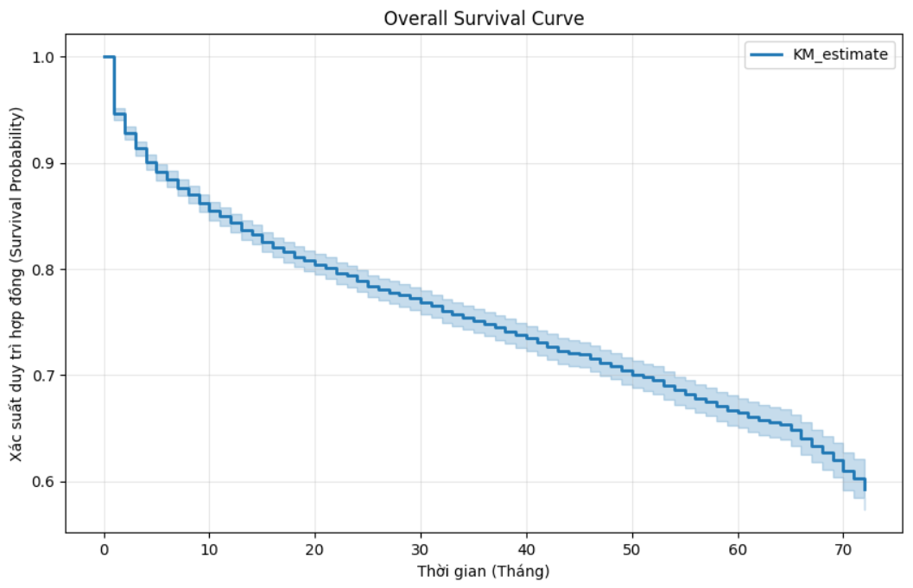
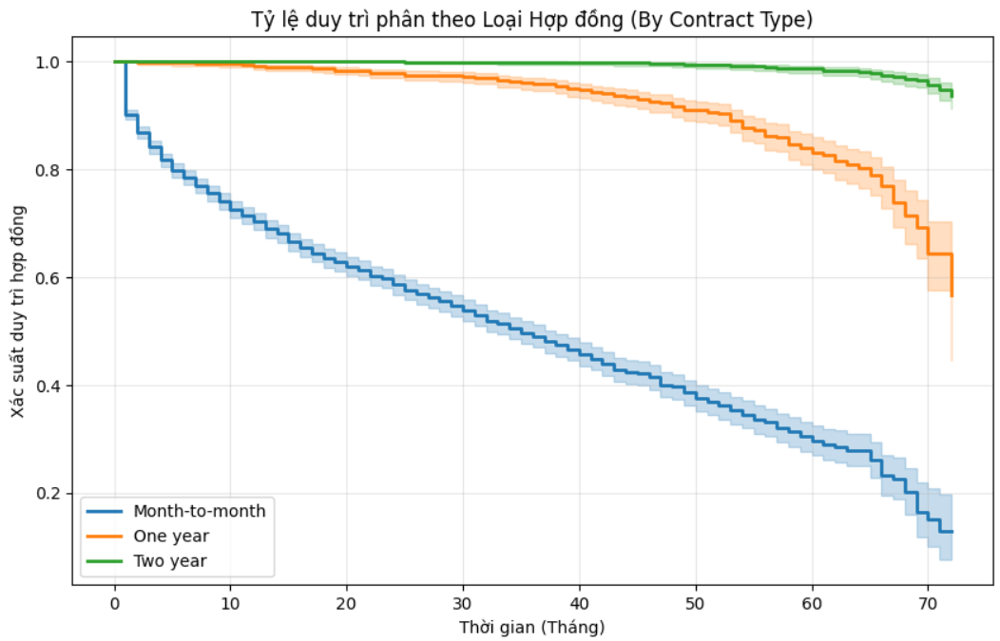
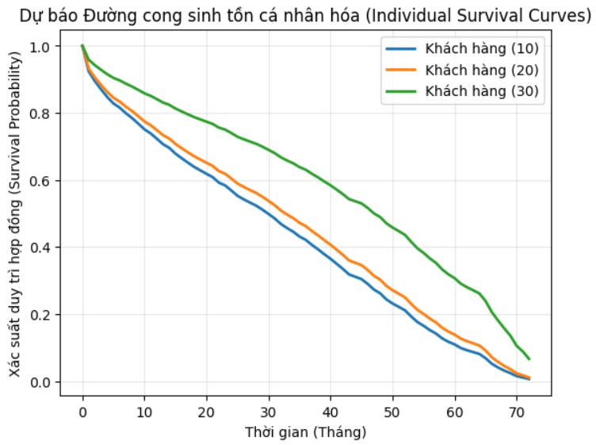

# 🛡️ Customer Lapse Modeling: A Survival Analysis Approach


## 📌 Project Overview
In the insurance and subscription-based industries, predicting **when** a customer will leave (Lapse/Surrender) is far more valuable than simply predicting *if* they will. This project applies Actuarial Survival Analysis techniques—specifically the **Kaplan-Meier Estimator** and the **Cox Proportional Hazards (CPH) Model**—to quantify customer retention risk.

The methodology focuses on "Time-to-Event" modeling, providing actionable insights for dynamic pricing and proactive retention strategies.

## 🛠️ Data Pipeline & Actuarial Preprocessing
To ensure the robustness of the Cox PH model, the following rigorous data cleaning steps were performed:
- **Missing Value Imputation:** Handled `TotalCharges` for new policyholders (`tenure = 0`) by filling with 0, ensuring no loss of initial exposure data.
- **Outlier Management (Winsorizing):** Applied IQR-based capping on `MonthlyCharges`. This treats "Jumbo Risks" (extreme premiums) to prevent them from disproportionately biasing the Hazard Ratios.
- **Feature Engineering:** Transformed categorical variables (Contract, Payment Method, etc.) into numeric formats while ensuring the avoidance of multicollinearity using `drop_first=True`.

## 📈 Key Visualizations & Results

### 1. Overall Survival Probability
The Kaplan-Meier estimate reveals the macro-level retention trend of the portfolio. The "steps" in the curve identify critical periods where churn events are most frequent.


### 2. Risk Segmentation by Contract Type
Stratifying the portfolio by contract duration shows a significant survival advantage for long-term commitments. Month-to-month contracts exhibit a much steeper hazard rate compared to 1-year and 2-year terms.


### 3. Individualized Risk Scoring
Using the Cox PH model, we generated personalized survival curves for specific customer profiles. This enables "Dynamic Underwriting"—identifying high-risk individuals for targeted retention before the lapse occurs.


## 💡 Model Insights (Cox PH Summary)
- **Model Accuracy:** Achieved a **Concordance Index (C-index) of 0.923**, indicating superior predictive power in ranking individual risks.
- **Key Risk Drivers (Hazard Ratios):**
    - **Contract Term:** **Two-year contracts** are the strongest protective factor, reducing the hazard rate by **95%** ($exp(coef) = 0.05$) compared to month-to-month terms.
    - **Service Tier:** **Fiber Optic** users exhibit a hazard rate **4.19 times higher** than DSL users, suggesting significant price sensitivity or competitive pressure in high-tier segments.
    - **Support Services:** Having **Tech Support** reduces the likelihood of churning by **42%** ($exp(coef) = 0.58$).
    - **Payment Behavior:** Customers using **Electronic Checks** are **57% more likely** to churn than those on automated payment systems.

## 🚀 Technical Requirements
```bash
pip install pandas numpy matplotlib lifelines jinja2 openpyxl
